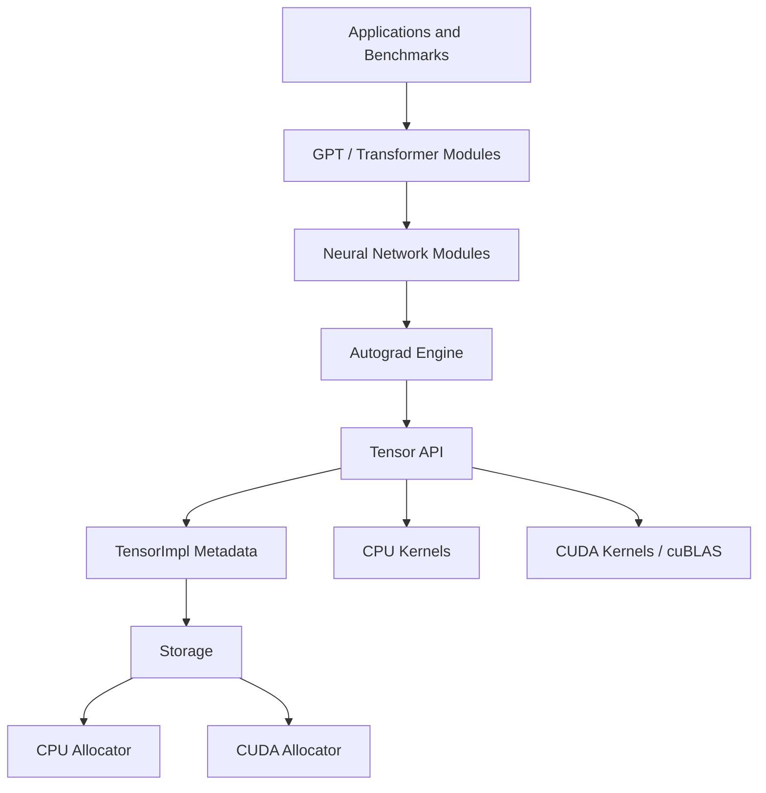

# TorchEngine

> A C++17/CUDA deep learning framework inspired by PyTorch, built to expose and optimize the implementation details behind tensors, autograd, neural network layers, transformer models, and GPU kernels.


## Table of Contents

- [Overview](#overview)
- [Key Features](#key-features)
- [Architecture / Design](#architecture--design)
- [CUDA & Performance](#cuda--performance)
- [Supported Operations](#supported-operations)
- [Autograd](#autograd)
- [Building](#building)
- [Usage](#usage)
- [Examples](#examples)
- [Benchmarking](#benchmarking)
- [Roadmap](#roadmap)
- [Project Structure](#project-structure)
- [Contributing](#contributing)
- [License](#license)

## Overview

TorchEngine is a small deep learning framework implemented in C++ and CUDA. It is designed as a systems and ML engineering project for understanding how modern tensor libraries and training frameworks are built: tensor metadata, storage ownership, CPU/GPU dispatch, reverse-mode automatic differentiation, neural network modules, optimizer state, and CUDA kernel optimization.

The project intentionally keeps the implementation visible. Instead of wrapping a full external tensor library, TorchEngine implements its own tensor abstraction, autograd graph, module interfaces, optimizers, CUDA allocation path, CUDA kernels, and benchmark harnesses. cuBLAS is used where appropriate as a production baseline for GEMM, while custom matrix multiplication kernels are kept in the repository for experimentation and profiling.

TorchEngine is not a drop-in replacement for PyTorch. The current repository is best viewed as a focused implementation and benchmarking environment for learning, testing, and iterating on deep learning framework internals.

## Key Features

| Area | Status | Notes |
| --- | --- | --- |
| Tensor abstraction | Implemented | `Tensor`, `TensorImpl`, and `Storage` separation with shape, stride, offset, dtype, device, views, slicing, reshape, transpose, broadcasting, and contiguous copies. |
| CPU tensor operations | Implemented | Elementwise arithmetic, reductions, activations, softmax, and N-dimensional/batched matrix multiplication. |
| CUDA tensor execution | Implemented / in progress | CUDA allocator, host/device transfers, CUDA elementwise ops, reductions, softmax, layer norm, embedding, cross entropy, GELU, AdamW update, and FP32 tensor matmul through cuBLAS or a custom backend. |
| Autograd | Implemented | Reverse-mode autodiff with explicit `GradFn` nodes, gradient accumulation, broadcasting-aware backward reductions, and backward implementations for core tensor and layer operations. |
| Neural network modules | Implemented | `Module`, `Linear`, `Embedding`, `LayerNorm`, `Dropout`, `ReLU`, `GeLU`, `Sequential`, scaled dot-product attention, multi-head attention, feed-forward network, transformer block, and GPT-style model. |
| Optimizers | Implemented | SGD, Adam, and AdamW. AdamW has a CUDA fused update path for CUDA tensors. |
| Mixed precision utilities | In progress | `Float16`/`BFloat16` dtype utilities, dtype casting, master-weight support in the optimizer base, and a loss scaler are present. Full mixed-precision training is not yet a complete feature. |
| Benchmarks | Implemented | GPT CPU/GPU benchmark, PyTorch comparison scripts, GEMM backend comparison, custom CUDA matmul sweep, and Nsight Compute sweep helper. |
| Distributed training | Planned | No distributed runtime is implemented. |

## Architecture / Design

TorchEngine follows a layered design similar to the internal structure of mainstream tensor frameworks.



### Core Abstractions

| Component | Responsibility |
| --- | --- |
| `Tensor` | User-facing value type. Exposes shape, dtype, device, indexing, math ops, views, autograd controls, and `backward()`. |
| `TensorImpl` | Shared tensor metadata: shape, strides, offset, dtype, `requires_grad`, accumulated gradient, and `grad_fn`. |
| `Storage` | Raw memory ownership and allocator association. Storage can be CPU or CUDA. |
| `Allocator` | CPU allocator uses `malloc`/`free`; CUDA allocator uses `cudaMalloc`/`cudaFree`. |
| `GradFn` | Base class for backward nodes. Derived classes implement operation-specific gradient propagation. |
| `Module` | Neural network layer interface: `forward`, `parameters`, `zero_grad`, and optional `to_cuda`. |

Autograd metadata lives in the shared `TensorImpl`, not only in the lightweight `Tensor` handle. This preserves gradient state and graph connectivity across tensor copies and views.

## CUDA & Performance

CUDA support is enabled when CMake finds CUDA. The build defines `USE_CUDA`, compiles `src/cuda/elementwise_cuda.cu`, enables CUDA language support, and links CUDA/cuBLAS libraries.

### Implemented CUDA Paths

| Area | Implementation |
| --- | --- |
| Memory | `CUDAAllocator` wraps `cudaMalloc` and `cudaFree`; `Tensor::toDevice` moves tensors between CPU and CUDA. |
| Elementwise kernels | Add, subtract, multiply, divide, ReLU, GELU, negation, and fill kernels. |
| Reductions | Scalar sum and dimension-wise sum kernels. |
| Softmax | Forward and backward CUDA kernels. |
| Layers | CUDA layer norm, embedding, batched cross entropy, and GELU backward helpers. |
| Optimizer | Fused CUDA AdamW update for FP32 parameters. |
| Tensor matmul | FP32 CUDA tensor matmul uses cuBLAS by default, including strided batched cuBLAS where possible. |
| Custom GEMM path | `TENSOR_GEMM_BACKEND=custom` routes contiguous row-major FP32 tensor matmul through a custom CUDA kernel and falls back to cuBLAS for unsupported layouts. |

### Custom Matrix Multiplication Kernels

The CUDA source includes multiple GEMM implementations for experimentation and benchmarking:

| Kernel family | Status | Techniques present |
| --- | --- | --- |
| Naive GEMM | Implemented | One output element per thread baseline. |
| Shared-memory GEMM | Implemented | Shared-memory tiles for data reuse. |
| Register-blocked GEMM | Implemented | Per-thread output blocking with shared-memory staging. |
| Vectorized-input GEMM | Implemented | `uint4` 16-byte vectorized memory movement where alignment/layout allows it. |
| Warp-tiled GEMM | Implemented | Warp-level output tiling and thread-level register tiles. |
| Double-buffered GEMM | Implemented | Two-stage shared-memory buffering. |
| `cp.async` GEMM | Implemented | Asynchronous global-to-shared copies on SM80+ paths. |
| Three-stage `cp.async` GEMM | Implemented | Multi-stage async pipeline. |
| WMMA Tensor Core GEMM | Implemented | FP16 input / FP32 accumulator Tensor Core kernel using `nvcuda::wmma`. |
| Ampere `mma.sync` GEMM | Implemented | FP16 input / FP32 accumulator path using inline `ldmatrix` / `mma.sync` assembly. |

The custom kernels are benchmark targets and selectable for some tensor matmul workloads. cuBLAS remains the default tensor GEMM backend because it is broader and more robust across layouts.

## Supported Operations

### Tensor Operations

| Operation | CPU | CUDA | Autograd |
| --- | --- | --- | --- |
| Construction, clone, fill | Implemented | Implemented | N/A |
| CPU/GPU transfer | N/A | Implemented | Copy backward implemented |
| Indexing with `at<T>` | Implemented | Limited direct host-side use | N/A |
| View / reshape | Implemented | Implemented | Implemented |
| Slice | Implemented | CPU metadata path | Not fully documented |
| Transpose view | Implemented | Implemented | Implemented |
| Contiguous copy | Implemented | Implemented via gather kernels | Copy backward implemented |
| Broadcasting | Implemented | Used by CUDA-capable ops where supported | Implemented for binary ops |
| Add / sub / mul / div | Implemented | Implemented | Implemented |
| Unary negation | Implemented | Implemented for FP32 | Implemented |
| Sum to scalar | Implemented | Implemented for FP32 | Used by backward paths |
| Sum over dimension | Implemented | Implemented for FP32 | Used for broadcast gradient reduction |
| Mean / min / max | Implemented on CPU | Not exposed as full CUDA reductions | Not fully implemented |
| ReLU | Implemented | Implemented | Implemented |
| GELU | Implemented | Implemented for FP32 | Implemented |
| Sigmoid | Implemented | CPU path | Implemented |
| Sqrt / exp / log / pow | Implemented | CPU path | Not fully implemented |
| Softmax | Implemented | Implemented for FP32 | Implemented |
| Matmul | Implemented | Implemented for FP32 tensors | Implemented |

### Neural Network Components

| Component | Status | Notes |
| --- | --- | --- |
| `Linear` | Implemented | Matmul plus bias broadcasting; parameters support `requires_grad`; `to_cuda()` implemented. |
| `Embedding` | Implemented | CPU and CUDA paths are present. |
| `LayerNorm` | Implemented | CPU and CUDA paths are present with backward support. |
| `Dropout` | Implemented | Training/inference behavior is tested. |
| `ReLU`, `GeLU` | Implemented | Module wrappers over tensor activations. |
| `Sequential` | Implemented | Basic module container. |
| Scaled dot-product attention | Implemented | Tested for several input shapes. |
| Multi-head attention | Implemented | Q/K/V projections and attention composition. |
| Feed-forward network | Implemented | Used by transformer block. |
| Transformer block | Implemented | LayerNorm, MHA, FFN, dropout, and residual structure. |
| GPT model | Implemented | Token embedding, positional embedding, transformer blocks, final norm, and language-model head. |

### Losses and Optimizers

| Component | Status |
| --- | --- |
| Cross entropy | Implemented, including batched CUDA helper. |
| MSE loss | Implemented. |
| BCE loss | Implemented. |
| L1 loss | Implemented. |
| SGD | Implemented. |
| Adam | Implemented. |
| AdamW | Implemented, with CUDA FP32 update helper. |
| Loss scaling | In progress utility; not a complete AMP training stack. |

## Autograd

TorchEngine implements reverse-mode automatic differentiation with explicit graph nodes.

Forward operations create `GradFn` instances when at least one input requires gradients. Calling `loss.backward()` traverses the graph in reverse and accumulates gradients into leaf tensors.

Implemented backward nodes include:

- Binary arithmetic: add, subtract, multiply, divide
- Matrix multiplication
- ReLU, GELU, sigmoid
- Cross entropy variants
- MSE, BCE, L1
- Transpose, view, reshape, copy
- LayerNorm
- Softmax
- Embedding

Broadcasting is handled during backward propagation by reducing gradients back to the original input shape. This is required for operations such as bias addition and broadcasted matmul batches.

## Building

### Dependencies

- CMake 3.14 or newer
- C++17 compiler
- GoogleTest
- CUDA Toolkit and cuBLAS for GPU support
- Python 3 for benchmark orchestration scripts
- PyTorch for comparison benchmarks only

CUDA support is intended to be optional in CMake, but the current repository is primarily exercised with a CUDA-capable toolchain because some test and helper headers include CUDA runtime headers directly. For a full build and test run, use a CUDA Toolkit installation with cuBLAS available.

### Configure and Build

```bash
cmake -S . -B build
cmake --build build -j$(nproc)
```

### Run Tests

```bash
cd build
ctest --output-on-failure
```

The CMake test suite currently registers the core tests and the general CUDA test target. Additional CUDA-specific test executables are built when CUDA is available and can be run directly:

```bash
./build/cuda_matmul_tensor_test
./build/cuda_softmax_tensor_test
./build/cuda_layernorm_tensor_test
./build/cuda_embedding_tensor_test
./build/cuda_crossentropy_tensor_test
./build/cuda_gelu_tensor_test
./build/cuda_reduction_tensor_test
```

## Usage

The public API is intentionally close to a minimal PyTorch-like workflow: create tensors, run operations, call `backward()`, and update parameters with an optimizer.

```cpp
#include "tensor/tensor.h"
#include "core/dtype.h"

int main() {
    Tensor x({2, 3}, DType::Float32, Device::CPU);
    Tensor w({3, 4}, DType::Float32, Device::CPU);

    x.fill_<float>(1.0f);
    w.fill_<float>(0.5f);
    w.setRequiresGrad(true);

    Tensor y = x.matmul(w);
    Tensor loss = y.sum_to_scalar();
    loss.backward();

    return 0;
}
```

CUDA tensors use the same `Tensor` type:

```cpp
Tensor cpu({1024, 1024}, DType::Float32, Device::CPU);
cpu.fill_<float>(1.0f);

Tensor gpu = cpu.toDevice(Device::CUDA);
Tensor out = gpu.matmul(gpu);
Tensor back = out.toDevice(Device::CPU);
```

## Examples

### Linear Layer

```cpp
#include "nn/linear.h"
#include "optimizer/sgd.h"

Tensor input({8, 16}, DType::Float32, Device::CPU);
input.fill_<float>(1.0f);

Linear layer(16, 32, DType::Float32);
Tensor output = layer.forward(input);
Tensor loss = output.sum_to_scalar();

loss.backward();

sgd opt(layer.parameters());
opt.step(1e-3f);
opt.zero_grad();
```

### GPT-Style Model

```cpp
#include "nn/gpt.h"
#include "loss/CrossEntropyLoss.h"
#include "optimizer/adamw.h"

GPT model(
    /* vocabSize */ 65,
    /* maxSeqLen */ 128,
    /* embedDim */ 64,
    /* numHeads */ 4,
    /* numLayers */ 2,
    /* ffDim */ 256,
    DType::Float32,
    /* dropoutRate */ 0.0f
);

Tensor tokens({2, 16}, DType::Int64, Device::CPU);
Tensor targets({2, 16}, DType::Int64, Device::CPU);

Tensor logits = model.forward(tokens);
CrossEntropyLoss loss_fn;
Tensor loss = loss_fn.forward(logits, targets);

loss.backward();

adamw opt(model.parameters(), 0.9f, 0.999f, 1e-8f, 0.01f);
opt.step(1e-3f);
```

## Benchmarking

TorchEngine includes benchmark programs and Python runners for reproducible local measurement. The benchmark suite compares:

- TorchEngine GPT training throughput on CPU and CUDA
- PyTorch GPT training throughput on CPU and CUDA
- TorchEngine CUDA GPT training with cuBLAS GEMM vs the custom GEMM backend
- Isolated custom CUDA matmul kernels vs cuBLAS baselines

Run the full benchmark suite:

```bash
python3 scripts/run_benchmark_suite.py \
  --build-dir build \
  --data data/tinyshakespeare.txt \
  --output-dir benchmark_outputs \
  --trials 7 \
  --sizes small,medium,large \
  --tensor-gemm-backends cublas,custom
```

Run only the matmul sweep:

```bash
python3 scripts/run_benchmark_suite.py \
  --skip-gpt \
  --trials 7 \
  --output-dir benchmark_outputs_matmul_only
```

The repository contains existing benchmark artifacts under `benchmark_outputs/` and `gpt_benchmark_gpu_results.json`. Treat these as local measurements from a specific environment, not general performance claims. The recorded GPT summary includes seven-trial CPU/CUDA comparisons against PyTorch for small, medium, and large toy GPT configurations. The recorded single GPU result was collected on an NVIDIA GeForce RTX 4070 with CUDA runtime 12.6 for a small GPT configuration.

For methodology and interpretation rules, see [BENCHMARKING.md](BENCHMARKING.md).

## Roadmap

| Area | Status | Next Work |
| --- | --- | --- |
| Tensor system | Implemented | Improve API consistency and document unsupported edge cases. |
| CPU autograd | Implemented | Expand gradient coverage for remaining unary/reduction operations. |
| CUDA tensor integration | In progress | Broaden dtype/layout support and register CUDA-specific tests with CTest. |
| Custom GEMM | In progress | Continue profiling against cuBLAS, document supported shapes/layouts, and keep correctness tests tied to each kernel generation. |
| Mixed precision | In progress | Integrate loss scaling, master weights, FP16/BF16 kernels, and Tensor Core paths into complete training flows. |
| Kernel fusion | Planned | Candidate fusions include bias+activation and transformer-block hot paths. |
| Memory management | Planned | Replace repeated `cudaMalloc`/`cudaFree` in hot paths with a CUDA memory pool or caching allocator. |
| Attention optimization | Planned | Investigate fused or FlashAttention-style attention kernels. |
| Distributed training | Planned | No implementation yet. |
| Public API hardening | Planned | Separate internal experiments from stable headers and add stronger documentation. |

## Project Structure

```text
.
|-- CMakeLists.txt
|-- BENCHMARKING.md
|-- TEST_PLAN.md
|-- tensor.md
|-- data/
|   `-- tinyshakespeare.txt
|-- scripts/
|   |-- run_benchmark_suite.py
|   |-- benchmark_pytorch_gpt.py
|   `-- pytorch_gpu_benchmark.py
|-- src/
|   |-- core/          # dtype utilities, CUDA helpers, autograd nodes, allocators, loss scaling
|   |-- cuda/          # CUDA kernels and GEMM implementations
|   |-- tensor/        # Tensor, TensorImpl, Storage
|   |-- nn/            # Modules, attention, transformer blocks, GPT
|   |-- loss/          # Cross entropy, MSE, BCE, L1
|   |-- optimizer/     # SGD, Adam, AdamW
|   |-- tests/         # GoogleTest coverage
|   `-- benchmarks/    # C++ benchmark binaries and profiling helpers
`-- benchmark_outputs/ # Local benchmark artifacts
```

## Contributing

Contributions should preserve the repository's focus: correctness first, measurements before performance claims, and clear separation between implemented features and experiments.

Before submitting changes:

```bash
cmake -S . -B build
cmake --build build -j$(nproc)
cd build
ctest --output-on-failure
```

For performance-related changes, include:

- The exact benchmark command
- Hardware and CUDA version
- Trial count
- Median and standard deviation
- Whether the result uses cuBLAS or a custom GEMM backend
- Correctness tests run on the same build

## License

No license file is currently present in the repository. Add a license before distributing TorchEngine or accepting external contributions.

